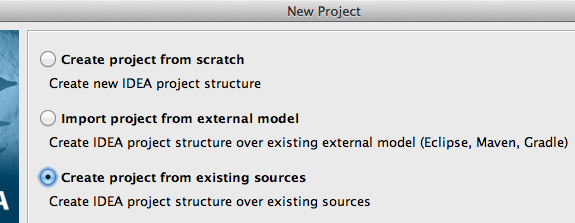
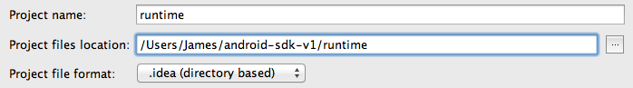
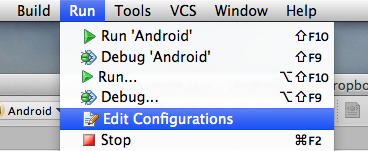
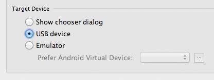
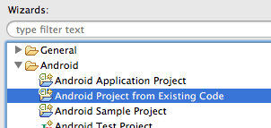

# Android SDK v1

This SDK is for building extensions to target beta 33 and compatible releases of the Android exporter.

*Note that this is not a complete guide to the extension development process, but rather instructions for existing extension developers to make use of the Android SDK.*
 
1. [Prerequisites](#prerequisites) 

2. [Building the Runtime](#building) 
    2.1. [Obtaining the source](#obtaining-source)
    2.2. [Exporting a CCN](#exporting-ccn) 
    2.3. [Building with Ant](#building-ant) 
    2.4. [Building with IntelliJ IDEA](#building-idea) 
    2.5. [Building with Eclipse](#building-eclipse) 

3. [Adding your Extension](#adding) 
    3.1. [Java or C/C++?](#java-or-c) 
    3.2. [Adding a new Java extension](#adding-java) 
    3.3. [Adding a new C/C++ extension](#adding-c) 

4. [Graphical Extensions](#graphical-extensions) 
    4.1. [In Java](#graphical-java) 
    4.2. [In C/C++](#graphical-c) 
    4.3. [With a View](#graphical-view)

5. [Packaging](#packaging) 

---

## <a id="prerequisites"> 1.  Prerequisites

- The official Android SDK, with the same API versions necessary for building from MMF2 (if you haven't already configured this, refer to the MMF2 documentation.)  The `tools` and `platform-tools` directories should be added to your `PATH` environment variable.

- If developing on Windows, the [appropriate drivers](http://developer.android.com/tools/extras/oem-usb.html) to use ADB with your device

- Either an installation of [Apache Ant](http://ant.apache.org/) or a Java IDE of your choice configured for Android development (such as [Eclipse](http://www.eclipse.org/downloads/), [IDEA](http://www.jetbrains.com/idea/) or [NetBeans](http://www.netbeans.org).)  If MMF2 is installed, Apache Ant can be found in the `Data/Runtime/Android` directory and may be simply added to your `PATH`.

- For C/C++ development, the [Android NDK](http://developer.android.com/tools/sdk/ndk/index.html) should be installed and added to your `PATH`. On Windows, you will also find it useful to have a [Cygwin](http://www.cygwin.com/) installation (although it's no longer necessary for the NDK).

- An installation of MMF2 with the Android exporter.  This need not be on the same machine as the SDK.

---

##  2. Building the Runtime

###  2.1.  Obtaining the source

The runtime source is installed with the Android exporter, and can be found in your MMF2 installation as `Data/Runtime/Android/RuntimeAndroid.zip`.  This should be extracted to the `runtime/` directory of the SDK.

###  2.2.  Exporting a CCN

The runtime requires an application.ccn in the `res/raw` directory to function.  MMF2 with the Android exporter has a hidden feature to export just the CCN and sounds for an application, without building an APK.

To use this, go to build an Android application as normal, but before selecting Save (in the `res/raw` directory of the SDK), hold down the shift key.  Continue to hold shift until the export is complete.

###  2.3.  Building with Ant 

If you prefer to work without an IDE, the runtime should compile out of the box with Apache Ant.  Simply navigating to the `runtime/` directory and running `ant debug` should be enough to produce an APK in `runtime/bin/`.

The APK can be (re)installed on a device with `adb`. For example:

    adb install -r ./bin/RuntimeAndroid-debug.apk

###  2.4.  Building with IntelliJ IDEA

Note that you should already have IDEA configured for Android development before attempting to work with the MMF SDK.  For more information, see the [idea-android documentation](http://code.google.com/p/idea-android/wiki/GettingStarted).

Select `File > New Project` and choose to create a project from existing sources:

When prompted, choose the `runtime` directory from this SDK package:

Then follow the wizard to create a project (you shouldn't have to change any of the defaults).  The runtime is now ready to work with like any other Android project in IDEA.

If you find that the application will only run on the emulator, it may be necessary to change the run configuration.  To do this, select `Edit Configurations` from the `Run` menu:

and change the target device as desired:

###  2.5.  Building with Eclipse

Note that you should already have Eclipse configured for Android development before attempting to work with the MMF SDK.  For more information, see [Installing ADT](http://developer.android.com/sdk/installing/installing-adt.html).

Select `File > New > Project` and choose the `Android Project from Existing Code` wizard:

When prompted for the root directory, choose the `runtime` directory from this SDK package:

The runtime is now ready to work with like any other Android project in Eclipse.

---

##  3.  Adding your Extension

###  3.1  Java or C/C++?

The MMF runtime for Android is a hybrid runtime, in which some of the code is written in Java and some (such as collision masks and the GL renderer) in C/C++.  Extensions may be written in either language.

Generally speaking, if your extension will do any of the following:

- Make use of Java Android APIs
- Make use of MMF runtime APIs beyond the simple action/condition/expression call pattern

You should be writing it in Java. However, if the above limitations do not apply *and* your extension will:

- Be performance critical
- Make use of a C/C++ library
- Interact with the kernel
- Directly call OpenGL APIs

Then the C/C++ SDK may be more appropriate. It's also worth considering which languages your extension has already been ported to; if your extension works with the Java runtime, it will probably already be compatible with Android.

###  3.2  Adding a new Java extension

The steps for this are nearly identical to the Java and Flash runtimes:

1. Create a new class under `Extensions`.  If your extension is called `Example.mfx`, the class would be called `CRunExample`.  It may help to make a copy of an existing extension as a starting point (I usually use `CRunGet`).

2. Edit the `CExtLoad` class under `Extensions`, adding your extension to the list before `// ENDCUT`.  For example:

     if (name.compareToIgnoreCase ("Example") == 0)
     {
        object = new CRunExample ();
     }

###  3.3  Adding a new C/C++ extension

1. Inside the `native` directory, copy `CRunTemplate` and rename it to the name of your extension.  If your extension is called `Example.mfx`, the new directory would be called `CRunExample`.

2. Open the `Android.mk` file in your new directory, and update `LOCAL_MODULE` to the correct name

3. From a terminal, run `ndk-build` in the directory.  This should produce a set of shared objects (one for each architecture) in the `libs` directory, which should be copied to `runtime/assets/mmf/`.

In the `tools/` directory, a script called `install-native` is provided to automate the process of building native extensions and copying over the shared objects.  (On Windows, you should run it under Cygwin bash.)

---

##  4.  Graphical Extensions

Like the iOS runtime, the Android runtime is hardware accelerated using OpenGL ES 2.0.  Extensions should only ever draw to the screen in `displayRunObject`.

###  4.1.  In Java

The renderer class used by most of the runtime is available in `GLRenderer.inst`, providing high-level methods for drawing images and primitives to the screen.  In most cases, this is recommended over using OpenGL directly.

If direct access to the OpenGL APIs is required, extensions are permitted to `import android.opengl.GLES20` and use the `GLES20.*` methods as they desire, providing they are only called from within `displayRunObject`.  Note that this might break if future versions of the runtime don't use ES 2.0 in all cases (while the high-level renderer obviously will not).

###  4.2.  In C/C++

The high-level renderer is not available in C/C++, so the only option is to use the ES 2.0 methods directly.  OpenGL is usually more convenient to work with from C than Java, but the issue of possible breakage with future runtime versions still applies.

The native extension template links with `libGLESv2` by default.

###  4.3.  With a View

If your extension is going to host a [View](http://developer.android.com/reference/android/view/View.html) (as, for example, the Button object does):

1. Extend `CRunViewExtension` instead of `CRunExtension`
2. In `createRunObject`, create your `View` and pass it to `setView`
3. If you have actions to set the position of your object, call `setViewX`, `setViewY` or `setViewPosition`
4. If you have actions to set the size of your object, call `setViewWidth`, `setViewHeight` or `setViewSize`

The runtime will then ensure that your view is correctly displayed.  View extensions cannot be written in C/C++.

---

##  5.  Packaging

MMF2 searches for Android extensions in the `Data/Runtime/Android` directory, as ZIP archives to merge with the runtime source before building.

To distribute your extension, you should create a ZIP with the same structure as the `runtime/` directory from the SDK.  For example, `Data/Runtime/Android/Get.zip` contains just one correctly nested file:

    ./src/Extensions/CRunGet.java

And `Data/Runtime/Android/AESFusion.zip` (a C extension) contains the shared objects for three different architectures:

    ./assets/mmf/armeabi/CRunAESFusion.so
    ./assets/mmf/armeabi-v7a/CRunAESFusion.so
    ./assets/mmf/x86/CRunAESFusion.so
    
An extension package may contain anything, including additional resources (such as images, sounds or shaders) for the `res/` directory.

